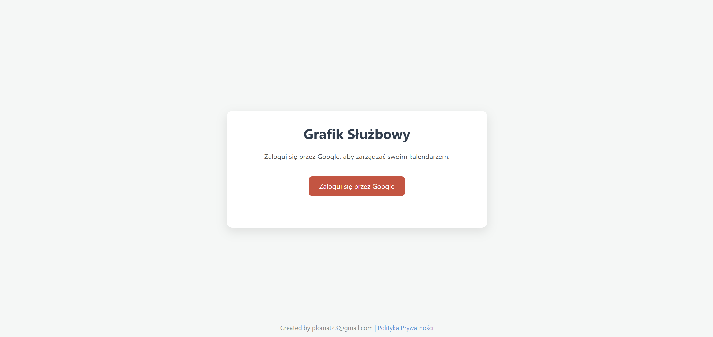
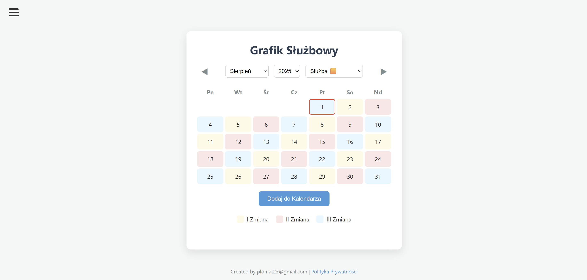

# Interactive Google Calendar Scheduler

A web application built with **FastAPI** that allows users to interactively select dates on a calendar and add various event types (e.g., duty, day off) directly to their **Google Calendar**.

---

## Key Features

* **Google OAuth 2.0 Integration:** Securely log in with your Google account.
* **Interactive Calendar UI:** A dynamic, client-side rendered calendar for easily selecting and deselecting multiple dates.
* **Custom Event Types:** Define different types of events (e.g., Duty, Day Off) with unique colors.
* **Continuous Shift Cycle:** The calendar's background follows a continuous, 3-day shift cycle.
* **Direct Calendar Integration:** Events are added to the user's primary calendar with a single click.
* **Responsive Design:** The interface is designed to work on both desktop and mobile devices.

---

## Tech Stack

* **Backend:** Python, FastAPI
* **Frontend:** HTML, CSS, Vanilla JavaScript
* **Authentication:** Google OAuth 2.0
* **API:** Google Calendar API v3
* **Configuration:** Pydantic, python-dotenv

---

## Installation and Setup

Follow these steps to set up and run the project locally.

### 1. Prerequisites

* **Python 3.9+**
* A Google account and a configured project in the **Google Cloud Console**.

### 2. Clone the Repository

```bash
git clone [https://github.com/YOUR_USERNAME/google-calendar-scheduler.git](https://github.com/YOUR_USERNAME/google-calendar-scheduler.git)
cd google-calendar-scheduler
```

3. Create and Activate a Virtual Environment
Windows:
```bash
python -m venv .venv
.\.venv\Scripts\activate
```
macOS / Linux:
```bash
python3 -m venv .venv
source .venv/bin/activate
```

4. Install Dependencies
```bash
pip install -r requirements.txt
```
5. Configure Environment Variables
You need to create two configuration files in the project's root directory:

a) .env file:
This file stores the session secret key. Create it and add the following content:
```bash
# Generate a random string (e.g., using `secrets.token_hex(32)` in Python)
SECRET_KEY="your_super_long_and_random_secret_key_here"
```
b) credentials.json file:
This file contains your Google OAuth credentials.

Go to your project in the Google Cloud Console.

Navigate to "APIs & Services" > "Credentials".

Create an "OAuth 2.0 Client ID" for a "Web application".

In the "Authorized redirect URIs" field, add: http://127.0.0.1:8000/auth/callback

Download the JSON file, rename it to credentials.json, and place it in the project's root directory.

---

## Usage
Once the setup is complete, run the FastAPI application using uvicorn:
```bash
uvicorn app.main:app --reload
```
The application will be available in your browser at http://127.0.0.1:8000.

---

## Screenshots

Below are a few snapshots of the application interface.

### 1. Login Page
*The initial view of the application prompting the user to sign in with Google.*



### 2. Google Authentication
*The standard Google account selection screen during the OAuth 2.0 flow.*


### 3. Main Calendar View
*The interactive calendar interface available after a successful login.*

